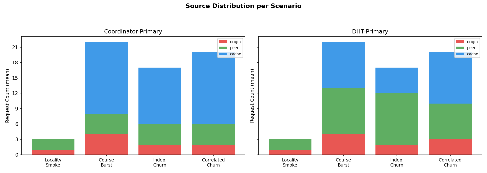
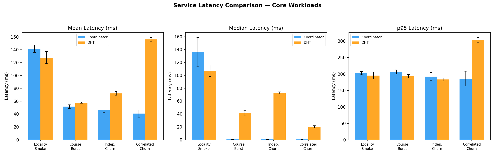
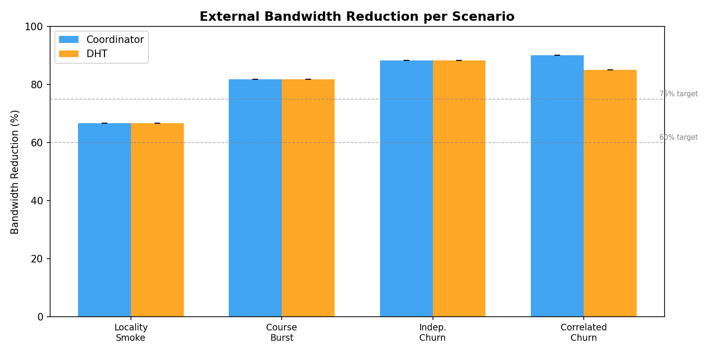
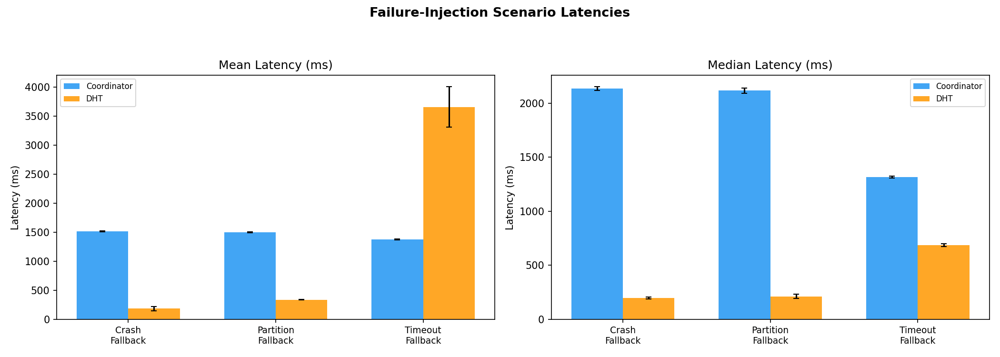

# Phase 10 Report Handoff (Cloud, Multi-Run)

Generated on: **2026-04-13**

## Scope

- Platform: GKE (`resilientp2p-492916`)
- Stacks compared:
  - Coordinator-primary + DHT fallback
  - DHT-primary + Coordinator fallback
- Run count used in aggregate outputs:
  - Coordinator stack: **5 runs**
  - DHT stack: **5 runs**

Primary source files:

- `results-aggregate/aggregate-summary.json`
- `results-aggregate/aggregate-summary.md`
- `results-aggregate/plots/*.png`

## Core Workload Results (mean +/- std)

| Scenario | Stack | Success Rate | Mean Latency (ms) | Median Latency (ms) | p95 Latency (ms) | Sources | BW Reduction |
|---|---|---:|---:|---:|---:|---|---:|
| Explicit Locality Smoke Test | Coord | 1.00 | 141.72 +/- 5.63 | 136.07 +/- 22.61 | 202.73 +/- 4.77 | origin=1.0, peer=2.0 | 66.7% |
| Explicit Locality Smoke Test | DHT | 1.00 | 127.80 +/- 9.45 | 107.23 +/- 8.86 | 195.62 +/- 10.97 | origin=1.0, peer=2.0 | 66.7% |
| Course Burst Workload | Coord | 1.00 | 51.65 +/- 2.88 | 0.62 +/- 0.18 | 206.07 +/- 6.54 | origin=4.0, peer=4.0, cache=14.0 | 81.8% |
| Course Burst Workload | DHT | 1.00 | 57.83 +/- 1.25 | 41.18 +/- 3.89 | 193.02 +/- 5.48 | origin=4.0, peer=9.0, cache=9.0 | 81.8% |
| Burst With Independent Churn | Coord | 0.85 | 46.89 +/- 4.14 | 0.55 +/- 0.15 | 192.35 +/- 12.47 | origin=2.0, peer=4.0, cache=11.0 | 88.2% |
| Burst With Independent Churn | DHT | 0.85 | 72.07 +/- 2.93 | 72.69 +/- 1.72 | 183.14 +/- 4.79 | origin=2.0, peer=10.0, cache=5.0 | 88.2% |
| Correlated Class Exit Churn | Coord | 0.91 | 40.76 +/- 5.72 | 0.48 +/- 0.10 | 186.19 +/- 22.53 | origin=2.0, peer=4.0, cache=14.0 | 90.0% |
| Correlated Class Exit Churn | DHT | 0.91 | 156.10 +/- 2.90 | 20.03 +/- 1.66 | 303.23 +/- 7.78 | origin=3.0, peer=7.0, cache=10.0 | 85.0% |

## Failure Injection Results (mean +/- std)

| Scenario | Stack | Success Rate | Mean Latency (ms) | Median Latency (ms) | p95 Latency (ms) | Sources |
|---|---|---:|---:|---:|---:|---|
| Coordinator Failure Fallback Smoke Test | Coord | 1.00 | 1514.69 +/- 8.62 | 2133.67 +/- 16.67 | 2200.52 +/- 14.35 | origin=2.0, peer=1.0 |
| DHT Failure Fallback Smoke Test | DHT | 1.00 | 185.03 +/- 38.79 | 197.39 +/- 7.60 | 249.55 +/- 97.40 | origin=2.0, peer=1.0 |
| Coordinator Partition Fallback Test | Coord | 1.00 | 1503.20 +/- 7.50 | 2115.48 +/- 23.06 | 2192.95 +/- 9.99 | origin=2.0, peer=1.0 |
| DHT Partition Fallback Test | DHT | 1.00 | 336.52 +/- 4.33 | 212.98 +/- 17.89 | 645.86 +/- 2.69 | origin=2.0, peer=1.0 |
| Coordinator Timeout Fallback Test | Coord | 1.00 | 1377.50 +/- 5.31 | 1317.30 +/- 9.00 | 2478.55 +/- 13.51 | origin=2.0, peer=1.0 |
| DHT Timeout Fallback Test | DHT | 1.00 | 3658.24 +/- 348.06 | 684.82 +/- 13.84 | 9140.47 +/- 937.48 | origin=3.0 |

## Key takeaways for report text

1. Both architectures sustain high bandwidth reduction in core workloads (81.8% to 90.0%).
2. Coordinator-primary shows lower medians in churn-heavy core scenarios.
3. DHT-primary exhibits higher tail latency under correlated churn and timeout-fallback conditions.
4. DHT timeout path remains the weakest reliability/latency case and should be reported as a known limitation.

## Follow-On Work From Report Limitations

The report also identifies three future-work areas beyond the completed cloud evaluation. These should be treated as the next product-hardening phase, not as part of the Phase 10 evaluation claim.

| Order | Workstream | Difficulty | Primary validation target |
|---:|---|---|---|
| 1 | Dynamic object invalidation | Medium | Warm object, invalidate it, then verify the next peer request does not serve stale cache data |
| 2 | Peer authentication and access control | Medium-Hard | Unauthorized peers cannot register, publish, lookup restricted objects, or fetch restricted bytes |
| 3 | Malicious-peer resilience | Hard | Bad providers are detected, deprioritized/quarantined, and healthy providers continue serving |

Recommended first implementation target:

- Start with dynamic invalidation because it improves cache correctness without requiring a full security model.
- Keep existing immutable-object behavior as the default so the current evaluation remains reproducible.
- Add authentication before peer reputation, because malicious-peer tracking requires stable peer identity.

## Plot artifacts

- `results-aggregate/report-images/source-distribution.png`
- `results-aggregate/report-images/latency-comparison.png`
- `results-aggregate/report-images/bandwidth-reduction.png`
- `results-aggregate/report-images/failure-latency.png`

## Embedded Figures

### Source Distribution

### Latency Comparison

### Bandwidth Reduction

### Failure Scenario Latencies

## Notes

- One suite execution event reported a run failure during DHT run-005 timeout setup, but final aggregate inputs currently contain 5-run data for both stacks in the generated summaries.
